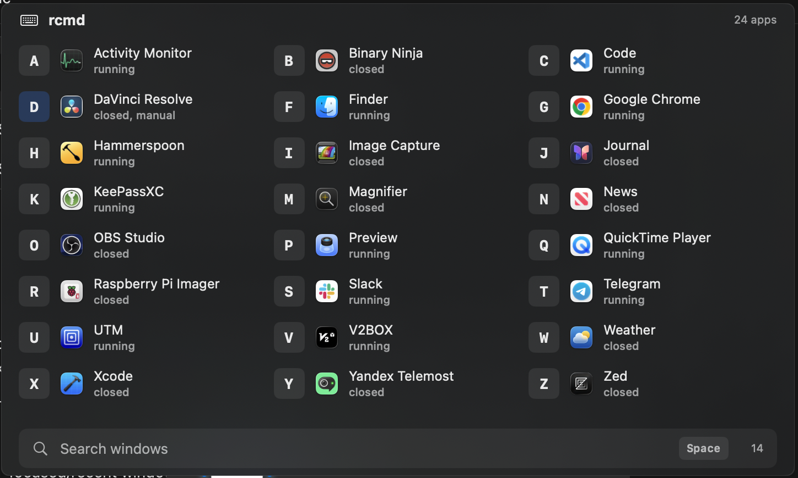
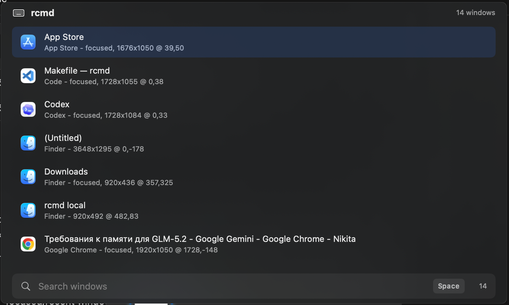
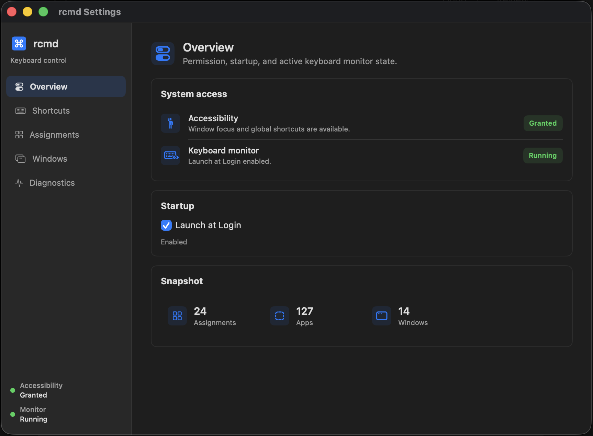

# rcmd

Native macOS keyboard switching for apps and windows.

`rcmd` is a menu bar utility inspired by the original rcmd idea: use the
right-side Command key as a fast, low-friction switcher while leaving normal
left Command shortcuts alone.

> Status: MVP in active development. Local builds are ad-hoc signed and not
> notarized yet.



## What Works

- Hold **⌘** to show app assignments in a polished OSD.
- Press **⌘ + letter** to focus a running app or launch a closed
  app.
- Press **⌘ + Space** to search open windows by title or app.
- Use **Up/Down**, **Enter**, **Escape**, **Backspace**, and mouse clicks in
  window search.
- Press **⌘ + Tab** to focus the next readable window.
- Create manual assignments with **⌘ + Right Option + letter**.
- Use the Quick Start window for first-run permission setup and core shortcut
  hints.
- Use localized UI strings for English, Russian, German, Spanish, French, and
  Italian, with English as the fallback.
- Edit assignments, key mapping, Launch at Login, and diagnostics in Settings.
- Optionally minimize the active window when its app shortcut is pressed again.
- Persist config in readable YAML at `~/.config/rcmd/config.yaml`.
- Package the app as a local DMG with an `Applications` shortcut.

## Screenshots

### Window Search



### Settings Overview



## Install For Local Testing

Build the DMG:

```sh
make package
```

Open it:

```sh
open dist/rcmd-local-macos.dmg
```

Drag `rcmd.app` to `Applications`, then launch it normally.

The current DMG is ad-hoc signed for local testing. On another Mac, Gatekeeper
may warn that the app is from an unidentified developer. A smoother public
install flow needs Developer ID signing, notarization, and stapling.

## First Run

`rcmd` needs macOS Accessibility permission to read global keyboard events and
focus windows.

1. Launch `rcmd.app`.
2. Use the Quick Start window to grant Accessibility permission.
3. Hold **⌘** to show app assignments.
4. Try **⌘ + letter**, **⌘ + Space**, and **⌘ + Tab**.

If the permission state looks stale, quit and relaunch the app after granting
the permission.

Debug builds show Quick Start after every launch so the first-run flow can be
tested repeatedly. The menu bar item also includes **Quick Start...**.

## Shortcuts

| Shortcut | Action |
| --- | --- |
| `⌘` | Show app assignment OSD |
| `⌘ + letter` | Focus or launch assigned app |
| `⌘ + letter` again | Optionally minimize the active window |
| `⌘ + Space` | Toggle window search |
| `Up / Down` in search | Move selected window |
| `Enter` in search | Focus selected window |
| `Escape` in search | Close search |
| `⌘ + Tab` | Focus next readable window |
| `⌘ + Right Option + letter` | Assign frontmost app |

## Settings

The Settings window is split into focused panes:

- **Overview**: Accessibility, keyboard monitor, Launch at Login, app/window
  counts.
- **Shortcuts**: active shortcuts, repeated-shortcut behavior, and key mapping
  mode.
- **Assignments**: manual assignment editor and current dynamic assignments.
- **Windows**: readable Accessibility window metadata.
- **Diagnostics**: status messages and recent key events.

Key mapping modes:

- **Physical keys** uses QWERTY letter positions regardless of active keyboard
  layout.
- **Active layout** uses the active Latin macOS keyboard layout, with physical
  QWERTY fallback for non-Latin layouts.

## Languages

The app follows the user's macOS language preferences automatically. Current
localizations are English, Russian, German, Spanish, French, and Italian. If
the preferred system language is not available, the app falls back to English.

## Config

Manual assignments and key mapping mode are saved to:

```text
~/.config/rcmd/config.yaml
```

Example:

```yaml
keyMappingMode: activeLayout
minimizeActiveWindowOnRepeatedShortcut: false
assignments:
  c: com.google.Chrome
  f: com.apple.finder
```

## Development

Build:

```sh
swift build
```

Run from SwiftPM:

```sh
swift run rcmd-app
```

Run CI-style local checks:

```sh
make ci
```

Package:

```sh
make package VERSION=0.1.0
```

`make ci` builds the SwiftPM package, runs the XCTest suite, and verifies app
bundle packaging.

## Logs

Keyboard and app logs use the `dev.local.rcmd` subsystem:

```sh
log stream --level debug --style compact --predicate 'subsystem == "dev.local.rcmd"'
```

If the menu bar item is not visible, check whether the process is running:

```sh
pgrep -fl rcmd-app
```

## Release

Every branch push and pull request runs GitHub Actions CI. Pushing a semantic
version tag like `v0.1.0` runs the release workflow, builds the app, packages
`rcmd.app` into a DMG, and publishes a GitHub Release.

Create the next patch tag locally:

```sh
make release
git push origin vX.Y.Z
```

Useful variants:

```sh
make release BUMP=minor
make release VERSION=0.2.0
make release-push
```

Public distribution still needs:

- Developer ID Application signing;
- hardened runtime;
- Apple notarization;
- stapling the notarization ticket to the DMG.

## Current Limitations

- Release artifacts are not Developer ID signed or notarized yet.
- Window cycling and search do not yet provide MRU ordering or ranked fuzzy
  search.
- Window search does not yet expose close, quit, or hide actions.
- YAML support is intentionally minimal.
- Test coverage is intentionally small and currently focuses on shortcut
  routing, config persistence, and window search filtering.

## Project Notes

- [PROJECT_PLAN.md](PROJECT_PLAN.md) is the source of truth for roadmap,
  milestones, and current priorities.
- [AGENTS.md](AGENTS.md) contains workflow instructions for future AI agents.

This project is inspired by rcmd, but it is an independent implementation.
